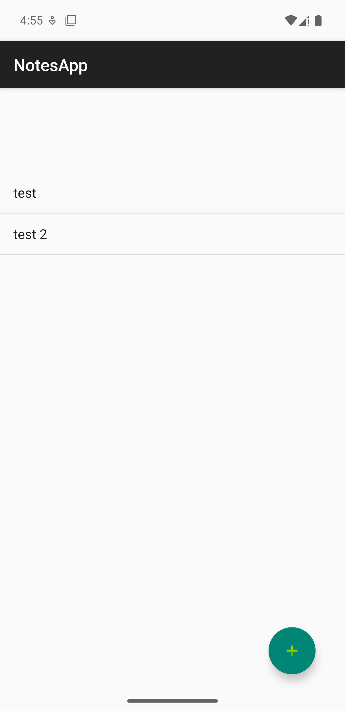
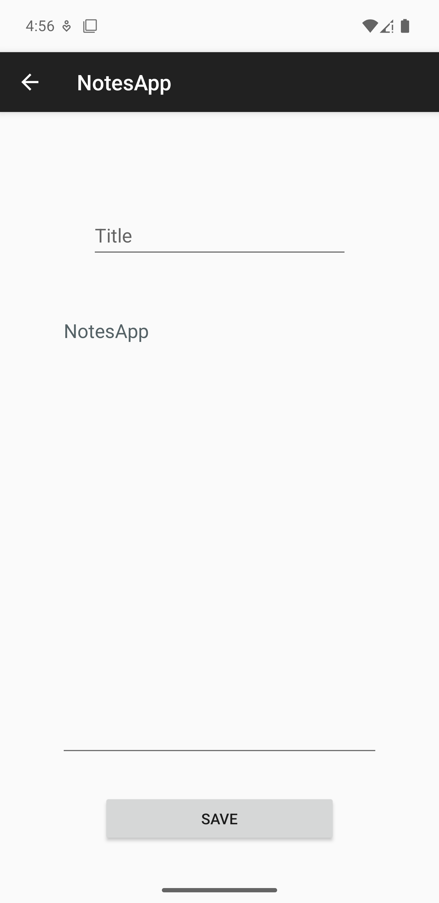

# Notes app

## Basic bare-bones notes taking android app written in java


This project is mainly for me to learn basics of android development.
The app allows users to create, edit, and delete notes.


## Features :

-Search bar (soon) <br> 
-Better ui (soon)

## Screenshots :






## Installation :

Clone this repository and import into Android Studio
``` bash
git clone git@github.com:rednt/NotesApp.git
```


